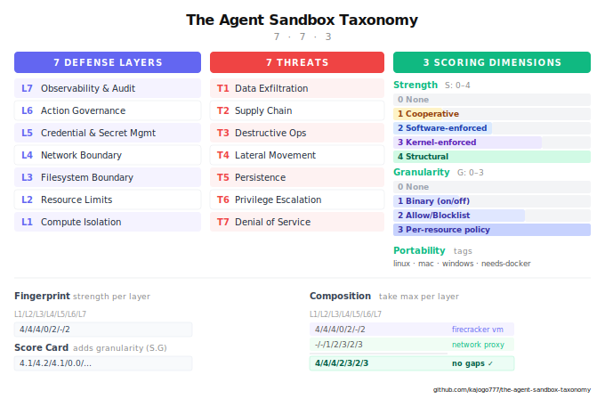
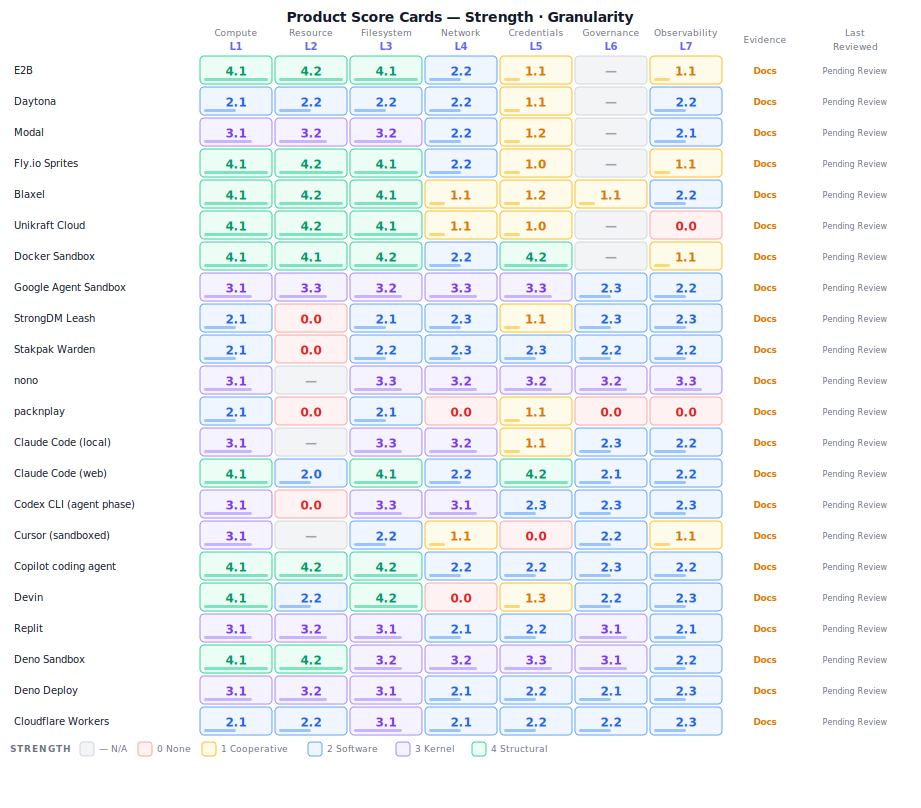
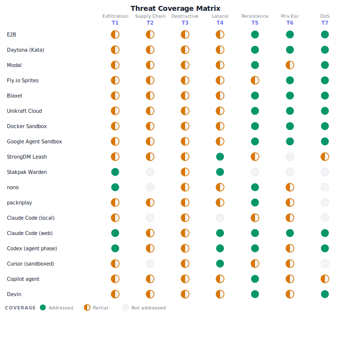

# The Agent Sandbox Taxonomy (AST)

*Version 1.0, March 2026*

> **⚠ Work in Progress — Pending Community Review**
>
> This taxonomy and the product scores within it are still a work in progress and have **not yet been reviewed by the community**. The agent sandbox space is evolving quickly and some information may already be out of date. Product scores in [`products.yaml`](products.yaml) include a `last_reviewed` timestamp — entries showing `null` have not been independently verified. We welcome contributions, corrections, and review from the community. Please open an issue or PR if you spot inaccuracies.

An open taxonomy and scoring framework for evaluating AI agent sandboxes. It decomposes sandboxing into **7 defense layers**, maps them against **7 threat categories**, and scores each mechanism on **3 dimensions** (strength, granularity, portability), producing comparable fingerprints for any product. Includes score cards for 22 sandbox tools, a composition framework for stacking complementary products, and a decision checklist for choosing the right sandbox stack.

<p align="center">
  
</p>

> **Looking for product scores?** Jump straight to the [22 Product Score Cards](#appendix-b-product-score-cards).
---

## How to Use This

This document provides a shared language for discussing what agent sandboxes do, what they don't do, and which threats they address. Remember **7-7-3**: **7** defense layers, **7** threat categories, **3** evaluation dimensions (strength, granularity, portability).

The document has two halves:

**The Taxonomy** ([Parts 1–5](#the-taxonomy)) defines what sandboxes *are*. Seven defense layers, seven threat categories, how they relate, how to score mechanisms, and how to fingerprint any product. Use it to describe, classify, and compare solutions on equal terms.

**The Framework** ([Parts 6–8](#the-framework)) defines what sandbox consumers should *do*. Composition patterns, anti-patterns, a decision checklist, and stacking rules. Use it to choose the right sandbox stack for your situation.

**The Appendix** contains product-specific data: [score cards](#appendix-b-product-score-cards), [threat coverage matrices](#appendix-c-threat-coverage-matrix), and [mechanism references](#appendix-a-layer-mechanism-reference). This is the only part that needs regular updating.

---

### Table of Contents

**The Taxonomy**
1. [The Problem](#1-the-problem)
2. [The Seven Layers](#2-the-seven-defense-layers)
   - [L1 Compute Isolation](#l1--compute-isolation)
   - [L2 Resource Limits](#l2--resource-limits)
   - [L3 Filesystem Boundary](#l3--filesystem-boundary)
   - [L4 Network Boundary](#l4--network-boundary)
   - [L5 Credential & Secret Management](#l5--credential--secret-management)
   - [L6 Action Governance](#l6--action-governance)
   - [L7 Observability & Audit](#l7--observability--audit)
3. [The Seven Threats](#3-the-seven-threats)
4. [Scoring](#4-scoring)
   - [Strength](#strength-s-04)
   - [Granularity](#granularity-g-03)
   - [Portability](#portability)
   - [The Fingerprint](#the-fingerprint)
5. [Glossary](#5-glossary)

**The Framework**

6. [Why Composition Is Necessary](#6-why-composition-is-necessary)
7. [Composition Patterns](#7-composition-patterns)
8. [Decision Checklist](#8-decision-checklist)

**Appendices**
- [A Layer Mechanism Reference](#appendix-a-layer-mechanism-reference)
- [B Product Score Cards](#appendix-b-product-score-cards)
- [C Threat Coverage Matrix](#appendix-c-threat-coverage-matrix)
- [Conclusion](#conclusion)

---

# THE TAXONOMY

*What sandboxes are, how to describe them, and how to compare them.*

---

## 1. The Problem

When someone says "we sandbox our agents," that could mean anything from a Docker container with no security hardening to a hardware-isolated microVM with default-deny egress and credential proxying.

AI coding agents must support full development workflows (package installation, compilation, test execution, database access, browser automation) while treating every generated command as potentially hostile. The agent might misbehave because of a hallucination, a prompt injection, a compromised dependency, or a misunderstanding of intent. The sandbox doesn't care *why*. It enforces boundaries regardless.

The Taxonomy decomposes sandboxing into **seven defense layers** and maps them against **seven threat categories**, producing a precise vocabulary for what any sandbox does and doesn't do.

---

## 2. The Seven Defense Layers

Every sandbox enforces some combination of seven layers. No sandbox covers all seven equally. Most cover two or three well and ignore the rest.

| Layer | Name | Key Question |
|---|---|---|
| **L7** | Observability & Audit | Can you see what the agent did? |
| **L6** | Action Governance | Can you control what operations it performs? |
| **L5** | Credential & Secret Management | How are secrets handled around the agent? |
| **L4** | Network Boundary | What can it communicate with? |
| **L3** | Filesystem Boundary | What can it read, write, and delete? |
| **L2** | Resource Limits | Is it constrained in CPU, memory, disk, time? |
| **L1** | Compute Isolation | What separates the agent from the host? |

Layers are numbered bottom-up because lower layers are foundational. Strong L1 makes L3 easier: a microVM gets a fresh filesystem by default. But **upper layers cannot be derived from lower ones**. A microVM with perfect L1 but no L4 still lets the agent exfiltrate secrets via a single outbound request. A system with impeccable L1–L5 but no L7 gives you no way to detect misuse or improve policies.

### L1 — Compute Isolation
*What separates the agent's execution from the host system?*

L1 is the foundation. No upper layer can be stronger, because a process that escapes L1 bypasses everything above it. What matters is the **size of the shared attack surface** between the sandboxed workload and the host, ranging from the full host kernel (containers), through a reduced syscall surface (user-space kernels), to a minimal VMM (microVMs), to a single-purpose kernel (unikernels), to hardware-encrypted memory (confidential computing). See **[Appendix A](#appendix-a-layer-mechanism-reference)** for the mechanism spectrum.

### L2 — Resource Limits
*Can the agent exhaust CPU, memory, disk, or time?*

A fork bomb or memory leak can denial-of-service the host even inside a perfect L1 boundary. Enforcement must happen **outside the sandbox**: cgroups on the host, or VM resource allocation by the hypervisor. An agent with root inside its sandbox can bypass in-sandbox resource controls but cannot escape hypervisor-level caps.

### L3 — Filesystem Boundary
*What can the agent read, write, and delete on disk?*

The boundary must be **selective**, not total. Agents legitimately need to read/write project files. The real question is whether sensitive paths (`~/.ssh`, `~/.aws`, `.env`) are accessible. Ranges from full access through path allowlists, sensitive-path blocklists, ephemeral roots, immutable roots with writable overlays, to fully independent filesystems.

### L4 — Network Boundary
*What external systems can the agent communicate with?*

The most underappreciated layer. An agent inside a perfect compute sandbox with unrestricted network access can still exfiltrate every secret via a single outbound request.

**How traffic is intercepted matters as much as whether it's intercepted.** A network boundary that relies on the sandboxed process honoring `HTTP_PROXY` env vars is fundamentally different from one that intercepts at the kernel level. The process can trivially bypass proxy env vars via raw sockets, `--noproxy` flags, or custom DNS. This is reflected in the strength score: cooperative enforcement (process must opt in) is strength 1, regardless of how sophisticated the proxy is. Only opaque enforcement (kernel/hypervisor interception the process cannot circumvent) or structural enforcement (no network device exists) earns strength 3–4.

### L5 — Credential & Secret Management
*Can the agent see, use, or exfiltrate credentials?*

Even with strong L1–L4, an agent with API keys can embed them in generated code or commit them to a repo. Ideally, credentials are **never present** in the agent's environment. Ranges from full credential access through file blocking, env-var filtering, placeholder substitution (secrets detected and swapped with tokens, restored at execution), credential proxying (external proxy authenticates on behalf), to ephemeral per-session tokens.

### L6 — Action Governance
*Can the agent perform destructive or unauthorized operations?*

L6 is different from L1–L5. Those layers restrict **access to resources**. L6 restricts **what the agent does with the access it has**. An agent with legitimate cloud access can still terminate instances. An agent with legitimate DB credentials can still drop tables.

L6 operates at a **semantic level** that cuts across lower layers. L3 says "you cannot write to this path." L4 says "you cannot connect to this destination." L6 says "you cannot delete production resources," governing intent and effect regardless of which layer the action flows through. This lets L6 express policies no single lower layer can.

The tradeoff is that L6 is generally software-enforced and bypassable in ways kernel/hardware enforcement is not. A command blocklist can be circumvented via shell redirection. L6 is defense-in-depth, most valuable on top of strong L1–L4.

### L7 — Observability & Audit
*Can you see what the agent did, when, and why?*

Without observability, you cannot detect misuse, investigate incidents, improve policies, or demonstrate compliance. L7 turns a sandbox from a static boundary into an **adaptive security system**. Ranges from no logging through session-level logs, command-level audit, full telemetry (network, syscalls, MCP tool calls, real-time UI), to cryptographic audit chains (tamper-evident logs with provenance tracking).

---

## 3. The Seven Threats

Agents can cause seven categories of harm. Sandboxes exist to contain them.

| ID | Threat | What Goes Wrong | Example |
|---|---|---|---|
| **T1** | **Data Exfiltration** | Agent reads sensitive data and transmits it externally | Reads SSH keys, sends via outbound request |
| **T2** | **Supply Chain Compromise** | Agent introduces malicious code: compromised dependencies, binary replacement, build artifact poisoning | Malicious install script exfiltrates env vars; package replaces trusted binary |
| **T3** | **Destructive Operations** | Agent destroys or misconfigures resources, **both local and remote** | Local: `rm -rf /`. Remote: cloud resource deletion via API, dropping DB tables, `kubectl delete namespace` |
| **T4** | **Lateral Movement** | Agent reaches systems beyond its intended scope | Scans local network, hits cloud metadata endpoint |
| **T5** | **Persistence** | Agent survives sandbox destruction | Writes cron job, modifies shell init files, installs git hooks |
| **T6** | **Privilege Escalation** | Agent escapes the sandbox entirely | Exploits kernel CVE, container escape |
| **T7** | **Denial of Service** | Agent consumes excessive resources, degrading host or other tenants | Fork bomb, memory bomb, disk filling |

### Sandboxes Are Orthogonal to Agent Alignment

Prompt injection, hallucination, misalignment, bad context, compromised dependencies — these are all reasons an agent might **decide** to do something harmful. They are **vectors**, not threats. The taxonomy deliberately excludes them because sandboxes operate at a different level: they control what an agent **can** do, not what it **chooses** to do.

Getting an agent to make good decisions is an **agent alignment** problem (guardrails, RLHF, system prompts, context filtering). Preventing damage when it makes a bad decision is a **sandboxing** problem. The two are complementary but independent. A perfectly aligned agent still benefits from sandboxing (defense-in-depth). A perfectly sandboxed agent with bad alignment is still contained.

```
                              ┌─────────────────────┐
  Prompt Injection ──┐        │                     │
  Hallucination ─────┤        │  Agent Alignment    │  ← why the agent decided
  Misalignment ──────┼──▶     │  (out of scope)     │
  Bad context ───────┤        │                     │
  Malicious code ────┘        └────────┬────────────┘
                                       │
                                       ▼
                              Agent attempts harmful action
                                       │
                                       ▼
                              ┌─────────────────────┐
                              │                     │
                              │  Sandbox boundary   │  ← what the agent can do
                              │  (this taxonomy)    │
                              │                     │
                              └─────────────────────┘
```

### How Layers Defend Against Threats

Threats don't respect layer boundaries. A single destructive operation might involve reading a credential (L3/L5), making a network request (L4), and executing a destructive API call (L6).

| Threat | Primary Defenses | Why Multiple Layers Are Needed |
|---|---|---|
| **T1 Exfiltration** | L3 + L4 + L5 | L3 blocks reading secrets, L4 blocks sending them out, L5 ensures they're not present. Any single layer alone leaks. |
| **T2 Supply Chain** | L3 + L4 + L7 | L4 controls download sources, L3 protects filesystem integrity (prevents binary replacement), L7 detects compromises after the fact. |
| **T3 Destructive Ops** | L1 + L3 (local) / L4 + L6 (remote) | L1+L3 covers local destruction. **Remote destruction is a network operation**: needs L4 to block access AND L6 to block the action semantically. L1 alone doesn't protect remote resources. |
| **T4 Lateral Movement** | L4 + L1 | L4 blocks outbound access. L1 provides network namespace isolation as secondary boundary. |
| **T5 Persistence** | L1 + L3 + L6 | Ephemeral sandboxes (L1 destroyed) inherently prevent persistence. Persistent sandboxes need L3 to block init file writes and L6 to block scheduled task creation. |
| **T6 Privilege Escalation** | L1 + L2 | L1 strength directly determines escape resistance. Hardware boundaries are fundamentally harder to escape than software boundaries. |
| **T7 Denial of Service** | L2 + L1 | L2 caps resources. Enforcement must be outside the sandbox (cgroups, hypervisor allocation). |

**Threats are not independent.** T2 is often a vector to T1/T3/T4. T5 extends the window for any other threat. T6 nullifies all other layers. T7 can be a direct goal or a side effect.

### Threat Assessment Rules

Threat coverage is assessed **mechanically** from layer scores, not by intuition. For each threat, the primary defense layers have a **threshold of S >= 2** (software-enforced or stronger). The rating is determined by how many primary layers meet the threshold:

- **●** (Addressed): **All** primary layers meet the threshold
- **◐** (Partial): **At least one** primary layer meets the threshold, but not all
- **○** (Not addressed): **No** primary layer meets the threshold

| Threat | Primary Layers | ● (all meet threshold) | ◐ (some meet) | ○ (none meet) |
|---|---|---|---|---|
| **T1** | L3, L4, L5 | All three >= 2 | At least one >= 2 | None >= 2 |
| **T2** | L3, L4, L7 | All three >= 2 | At least one >= 2 | None >= 2 |
| **T3-L** | L1, L3 | Both >= 2 | One >= 2 | Neither >= 2 |
| **T3-R** | L4, L6 | Both >= 2 | One >= 2 | Neither >= 2 |
| **T4** | L4, L1 | Both >= 2 | One >= 2 | Neither >= 2 |
| **T5** | L1, L3, L6 (or ephemeral) | All three >= 2, or ephemeral L1 >= 4 | At least one >= 2 | None >= 2 |
| **T6** | L1, L2 | L1 >= 3 AND L2 >= 2 | At least one >= 2 | Neither >= 2 |
| **T7** | L2, L1 | Both >= 2 | At least one >= 2 | Neither >= 2 |

T3 is always split into local (T3-L) and remote (T3-R). The combined T3 rating uses the lower of the two. Notation: `L●/R○`, `L●/R◐`, `full L+R` (both ●).

Treat `~` (layer not addressed) as 0 for threshold comparisons.

---

## 4. Scoring

Each layer is rated on two dimensions, plus a portability tag. Together these are the **three evaluation dimensions** in the 7-7-3 structure.

### Strength (S: 0–4)

Strength combines robustness of enforcement, reversibility, and enforcement transparency into a single score. A boundary that can be bypassed, reversed, or opted out of earns a lower score regardless of how sophisticated the mechanism is.

| Score | Level | What It Means |
|---|---|---|
| **0** | None | No enforcement at this layer |
| **1** | Cooperative | Enforcement that the sandboxed process can circumvent, opt out of, or that can be reversed via escape hatch. Includes: proxy env vars the process can ignore, advisory restrictions, configurations with known bypass mechanisms. If the process can open a raw socket and skip your filter, it's S:1. |
| **2** | Software-enforced | Enforced by a separate process or proxy that the sandboxed process cannot circumvent from inside, but that can be reconfigured from outside by the operator. Includes: container-level isolation, hot-reloadable policy engines, MITM proxies with iptables redirect |
| **3** | Kernel-enforced | Enforced by the OS kernel through mechanisms that cannot be weakened once applied, even by the operator during the session. Includes: Landlock, Seatbelt, seccomp-BPF, kernel-level network filtering. Irreversible. |
| **4** | Structural | Enforced by CPU virtualization, hardware encryption, or architectural absence. The protected resource or attack surface doesn't exist inside the sandbox. Includes: KVM-isolated microVMs, unikernels, network-disabled sandboxes (no network device), credential proxies (secrets never enter sandbox), confidential VMs (SEV-SNP/TDX). |

**Key principle:** Cooperative enforcement is always S:1, regardless of how sophisticated the proxy is. If the kernel denies the syscall, it's S:3. If there's no network device to use, it's S:4.

### Granularity (G: 0–3)

How fine-grained is the control at this layer?

| Score | Level | What It Means |
|---|---|---|
| **0** | None | No control |
| **1** | Binary | On/off (e.g., "network: enabled/disabled") |
| **2** | Allowlist/Blocklist | Lists of permitted or denied resources (e.g., "allow these domains", "block these paths") |
| **3** | Per-resource policy | Fine-grained rules per resource, action, and context (e.g., "allow GET but deny DELETE", Cedar/OPA policies per connection) |

### Portability

A flat list of tags answering: **what OS does it run on, and what infrastructure does it need?**

Tags cover two dimensions — **OS support** and **infrastructure dependencies** — combined in a single array.

| Tag | Dimension | Meaning |
|---|---|---|
| **any-os** | OS | Works on Linux, macOS, and Windows |
| **linux** | OS | Requires Linux |
| **mac** | OS | Supports macOS |
| **cloud** | Infra | Runs in vendor's cloud; OS abstracted away |
| **docker** | Infra | Requires Docker or compatible container runtime |
| **k8s** | Infra | Requires a Kubernetes cluster |
| **kvm** | Infra | Requires `/dev/kvm` (bare metal or nested virtualization) |

No infrastructure tag means the tool runs directly on the OS with no extra dependencies.

Products typically have multiple tags (e.g., `[linux, mac]` or `[any-os, cloud]`).

### The Fingerprint

Every product gets a **fingerprint**, a CVSS-inspired vector string showing its strength score at each layer. Each entry is `Layer:Score`, separated by `/`.

**`0` vs `—` (dash):** Both mean "no coverage," but for different reasons. **`0`** means the product *operates* at this layer but provides no enforcement: the capability exists, it's just wide open (e.g., a cloud sandbox with an unrestricted network stack). **`—`** means the product *does not address* this layer at all; it's outside the product's scope (e.g., a policy tool that isn't a compute sandbox). For composition purposes both are treated as "no coverage," and any non-zero score from another product fills the gap.

**Full form**, self-describing, used in product score cards:
```
E2B      L1:4/L2:4/L3:4/L4:0/L5:2/L6:-/L7:2
```

**Compact form**, positional (L1 through L7, always in order), used in comparison tables and composition:
```
E2B      4/4/4/0/2/-/2
Leash    2/2/2/3/2/2/3
Warden   -/-/1/2/3/2/3
nono     3/-/3/3/3/2/2
```

The two forms are interchangeable. The compact form always includes all seven positions in L1→L7 order, so the layer labels can be read from the column header.

Score cards (see [Appendix B](#appendix-b-product-score-cards)) show each layer as `S.G`, strength and granularity separated by `.` (e.g., `4.1` = structural strength, binary granularity). The fingerprint uses strength only for the quick-compare view.

**Separator convention:** `:` binds a layer to its value (full form), `.` separates strength from granularity within a layer, `/` separates layers from each other.

See **[Appendix B](#appendix-b-product-score-cards)** for product score cards.

---

## 5. Glossary

| Term | Definition |
|---|---|
| **Blast radius** | Maximum damage when an agent is compromised or misbehaves |
| **Cooperative enforcement** | Enforcement relying on the sandboxed process respecting a convention (e.g., proxy env vars). Bypassable; always S:1 |
| **Defense-in-depth** | Layering multiple independent boundaries so failure of one doesn't compromise the system |
| **Escape hatch** | A mechanism allowing bypass of sandbox restrictions; its existence caps strength at S:1 |
| **Opaque enforcement** | Enforcement that works regardless of the sandboxed process's behavior. Cannot be circumvented; S:2–3 |
| **Structural enforcement** | Enforcement where the protected resource doesn't exist inside the sandbox. Nothing to bypass; S:4 |
| **Agent alignment** | The problem of getting an agent to make good decisions (guardrails, RLHF, context filtering). Complementary to but independent of sandboxing |
| **Vector** | An attack path through which a threat is triggered (prompt injection, hallucination, misalignment, compromised dependency). Distinct from the threat (T1–T7) it activates. Sandboxes are vector-agnostic |

---
---

# THE FRAMEWORK

*How to choose, compose, and stack sandbox solutions.*

---

## 6. Why Composition Is Necessary

No single product covers all seven layers well. This is by design: products that focus on L1–L3 (the isolation boundary) complement products that focus on L4–L7 (behavior governance, credentials, observability). Recognizing this is the most important insight from the Taxonomy.

The fingerprint makes this visible. Where one product shows `—` or `0`, another shows `3` or `4`. That's the complement. Stack them and the gaps disappear:

```
Firecracker VM       4/4/4/2/1/-/1  <- strong box, weak credentials, no governance
Network Proxy        2/0/2/2/2/2/2  <- no box, but governs behavior + secrets
-----------------------------------
Composed             4/4/4/2/2/2/2  <- take the max at each layer
```

When composing, **take the maximum strength at each layer**. The composed stack is only as weak as its weakest uncovered layer.

---

## 7. Composition Patterns

### Platform + Policy Layer
*"Strong box, smart guardrails"*

A cloud sandbox platform provides L1–L3 (hardware-isolated compute, resource limits, ephemeral filesystem). A policy tool layers L4–L7 (network policies, credential management, action governance, observability). Full-stack coverage.

### OS-Level Wrapper + Policy Sidecar
*"Lightweight local protection"*

A kernel-level process wrapper provides L1/L3/L5 with irreversible enforcement. A policy sidecar adds L4/L6/L7. Full stack minus L2 (resource limits). Zero cost, no cloud dependency.

### Built-in Sandbox + Cloud Fallback
*"Local for speed, cloud for untrusted"*

The agent's built-in sandbox handles trusted interactive work (L1/L3/L4). Untrusted operations offload to a cloud platform with full L1–L3.

### K8s-Native Stack
*"Enterprise, self-hosted, policy-driven"*

A Kubernetes sandbox CRD (L1/L2/L3) + NetworkPolicy (L4) + policy engine (L6) + secrets manager (L5) + monitoring stack (L7). Full stack, self-hosted.

### Anti-Pattern: Platform Without Network Controls

A cloud platform provides excellent L1/L2/L3, but the user deploys with default (unrestricted) network access and passes cloud credentials as env vars. The agent runs in a perfect microVM but can still exfiltrate credentials, delete cloud resources, and reach internal services.

**This is the most common configuration in practice and a false sense of security.** Strong L1 is necessary but not sufficient. Look at the fingerprint: if L4 is `0`, you have a problem.

---

## 8. Decision Checklist

Work through these questions in order to determine what your sandbox stack needs.

**1. What is your trust level in the code?**
Untrusted code requires L1 S:4 (microVM/unikernel). Your own reviewed code can use S:2–3.

**2. Does the agent interact with remote resources (cloud, databases, APIs)?**
If yes with read-write access: L1 does **not** protect remote resources. You need L4 (block destructive endpoints), L6 (block destructive actions semantically), or L5 (scoped read-only credentials).

**3. Does the agent need network access?**
If no, disable it (L4 S:4). This eliminates T1 and T4 in one step. If yes, use allowlists (S:2–3) and invest in L5 and L7.

**4. Does the agent handle credentials?**
Ideally credentials are never present (L5 S:4 via proxy or ephemeral tokens). Never pass raw credentials if avoidable.

**5. Can you tolerate human-in-the-loop?**
If no (autonomous agents), you need L6 S:2+ (policy engine). This is where behavioral governance tools become essential.

**6. Do you need audit trails?**
For compliance or team use, L7 S:2+ with structured logs. Consider cryptographic audit chains for regulatory requirements.

**7. Ephemeral or persistent sandbox?**
Ephemeral inherently addresses T5. Persistent sandboxes must explicitly address T5 via immutable filesystems or monitored mutation.

**8. What are your portability constraints?**
No infrastructure → process wrappers (no infra tag needed). Docker available → container wrappers, sidecars (`docker`). Cloud/K8s → full platform range (`cloud`, `k8s`).

### After the Checklist

Map your answers to layer requirements, then scan the [score cards (Appendix B)](#appendix-b-product-score-cards) for products that cover those layers at the required strength. Where no single product covers your needs, compose two using the stacking rule (take the max at each layer). Verify the composed fingerprint has no zeros or dashes at layers you care about.

---
---

# APPENDIX A: Layer Mechanism Reference

Catalogs mechanisms at each layer with strength and granularity. Products listed as examples, not exhaustive.

*Last updated: March 2026*

## A.1 — L1 Compute Isolation

| Mechanism | S | G | How It Works |
|---|---|---|---|
| Bare process | 0 | 0 | No isolation; full user privileges |
| Linux namespaces + cgroups | 2 | 1 | PID/mount/net/user namespace separation; shared host kernel |
| Namespaces + seccomp/Landlock/Seatbelt | 3 | 1–2 | Kernel-enforced syscall filtering or LSM; irreversible |
| User-space kernel (gVisor) | 3 | 1 | Intercepts ~200 syscalls in userspace; ~60 host syscalls exposed |
| MicroVM — minimal VMM (Firecracker) | 4 | 1 | Dedicated kernel per workload via KVM; ~50K line Rust VMM |
| MicroVM — container-shaped (Kata) | 4 | 1 | Container-shaped VM; CRI compatible; needs KVM |
| Unikernel | 4 | 1 | Single-app custom kernel; ~1MB image; needs KVM |
| Library OS | 3 | 1 | Embedded minimal OS library; experimental |
| Confidential VM (SEV-SNP/TDX) | 4 | 1 | Hardware-encrypted memory; even hypervisor cannot read |

## A.2 — L2 Resource Limits

| Mechanism | S | G | How It Works |
|---|---|---|---|
| None | 0 | 0 | No limits |
| cgroups v2 | 3 | 2 | Kernel-enforced CPU/memory/I/O caps |
| VM resource allocation | 4 | 2 | Fixed vCPU/RAM/disk at VM creation |
| Platform quotas | 2 | 2 | Per-session or per-account limits |
| Time-bounded sessions | 2 | 1 | Auto-termination after time limit |

## A.3 — L3 Filesystem Boundary

| Mechanism | S | G | How It Works |
|---|---|---|---|
| No restriction | 0 | 0 | Full user filesystem |
| Working-dir-only mount | 3 | 2 | Only project dir visible; all else invisible |
| Sensitive-path blocklist | 3 | 2 | Most paths accessible; ~/.ssh, ~/.aws etc. blocked |
| Ephemeral root | 4 | 1 | Fresh OS per session; project mounted in |
| Immutable root + writable overlay | 4 | 2 | Read-only base; copy-on-write; rollback capable |
| Full independent filesystem | 4 | 1 | Separate disk; no host paths visible |

## A.4 — L4 Network Boundary

| Mechanism | S | G | How It Works |
|---|---|---|---|
| No restriction | 0 | 0 | Full network access |
| Proxy env vars | 1 | 2 | **Cooperative**: trivially bypassed via raw sockets |
| Transparent proxy (iptables redirect) | 2 | 3 | **Opaque**: all traffic redirected regardless of process |
| Kernel/hypervisor network filter | 3 | 2 | **Opaque**: iptables, eBPF, or Network Extension |
| MITM proxy (kernel-redirected) | 2–3 | 3 | **Opaque**: TLS-terminating; per-URL/method policies |
| Default-deny + exceptions | 3–4 | 2–3 | **Opaque/Structural**: all egress blocked; allowlist only |
| Network disabled | 4 | 1 | **Structural**: no network interface exists |

## A.5 — L5 Credentials

| Mechanism | S | G | How It Works |
|---|---|---|---|
| No restriction | 0 | 0 | Full credential set visible |
| Sensitive file blocking | 3 | 2 | Credential files blocked via L3; env vars still visible |
| Env-var filtering | 2 | 2 | Only approved variables forwarded |
| Placeholder substitution | 3 | 3 | Secrets swapped with tokens; restored at execution only |
| External credential proxy | 4 | 3 | Credentials never enter sandbox |
| Ephemeral per-session tokens | 4 | 3 | Time-bound, scoped credentials; auto-expire |

## A.6 — L6 Action Governance

| Mechanism | S | G | How It Works |
|---|---|---|---|
| No governance | 0 | 0 | Agent can do anything it has access to |
| Human-in-the-loop | 1 | 1 | Agent proposes; human approves |
| Command blocklist | 2 | 2 | Known-dangerous commands blocked |
| Policy engine (Cedar/OPA) | 2 | 3 | Fine-grained rules per action/resource/context |
| Declarative-only mode | 3 | 3 | Agent produces declarations only; cannot execute directly |

## A.7 — L7 Observability

| Mechanism | S | G | How It Works |
|---|---|---|---|
| No logging | 0 | 0 | No record of agent actions |
| Session-level logs | 1 | 1 | Start/stop, exit codes |
| Command-level audit | 2 | 2 | Every command, file op, tool call logged |
| Full telemetry | 3 | 3 | Network, syscalls, MCP calls, real-time UI |
| Cryptographic audit chain | 3 | 3 | Tamper-evident log with cryptographic commitments |

---

# APPENDIX B: Product Score Cards

Each product is scored `S.G` (Strength.Granularity) per layer. `0` = layer operates but unenforced; `—` = layer not addressed (see [The Fingerprint](#the-fingerprint)). All scores are maintained in [`products.yaml`](products.yaml).

<p align="center">
  
</p>

For full per-product details (granularity scores, mechanism notes, threat breakdowns, gaps, and complements), see [`products.yaml`](products.yaml).

---

# APPENDIX C: Threat Coverage Matrix

Threat coverage is derived **mechanically** from layer scores using the [threshold rules](#threat-assessment-rules) in Section 3. **●** Addressed — all primary defense layers meet S >= 2. **◐** Partial — at least one primary layer meets the threshold but not all. **○** Not addressed — no primary layer meets the threshold. T3 is split into local (L1+L3) and remote (L4+L6): `L●/R○` = local mitigated/remote not; `full L+R` = both.

<p align="center">
  
</p>

**Patterns**: Every product with L1 >= 2 and L3 >= 2 achieves T3-Local ●. T3-Remote is the sharpest differentiator — only products with both L4 >= 2 and L6 >= 2 achieve ●. Six products achieve all-● coverage: Google Agent Sandbox, Claude Code (web), Copilot coding agent, Replit, Deno Sandbox, and Deno Deploy — all have S >= 2 across every primary defense layer. No product scores T7:○ because every product has L1 >= 2.

### Composition Examples

```
                         L1/L2/L3/L4/L5/L6/L7
  E2B                     4/ 4/ 4/ 2/ 1/ -/ 1
+ Stakpak Warden          2/ 0/ 2/ 2/ 2/ 2/ 2
──────────────────────────────────────────────────
= Composed (max)          4/ 4/ 4/ 2/ 2/ 2/ 2   ← gaps filled
```

```
                         L1/L2/L3/L4/L5/L6/L7
  Claude Code (local)     3/ -/ 3/ 3/ 1/ 2/ 2
+ nono                    3/ -/ 3/ 3/ 3/ 3/ 3
──────────────────────────────────────────────────
= Composed (max)          3/ -/ 3/ 3/ 3/ 3/ 3   ← only L2 uncovered
```

---

# Conclusion

The Agent Sandbox Taxonomy provides a shared vocabulary — **7 defense layers**, **7 threat categories**, **3 evaluation dimensions** — for describing what any agent sandbox does and doesn't do.

**Three takeaways:**

1. **No single product covers all seven layers well.** Cloud platforms excel at L1–L3 (the isolation boundary) but leave L4–L7 (network, credentials, governance, observability) open. Policy tools cover the upper layers but have no compute boundary. This complementarity is by design — composition is not optional, it is the expected deployment model.

2. **The most common configuration is the most dangerous one.** A microVM with unrestricted network access and raw credentials as env vars looks secure. The fingerprint reveals the truth: L4:0 means exfiltration is one `curl` away. Always check the fingerprint before trusting the marketing.

3. **Sandboxes and agent alignment are independent problems.** Getting the agent to make good decisions (alignment) and limiting the damage when it makes bad ones (sandboxing) are complementary but separate. Invest in both. Neither substitutes for the other.

The [Taxonomy (Parts 1–5)](#the-taxonomy) and [Framework (Parts 6–8)](#the-framework) should remain stable. [Appendices (A–C)](#appendix-a-layer-mechanism-reference) are updated as products evolve — edit [`products.yaml`](products.yaml) and run `uv run python scripts/generate.py` to regenerate the visuals.

---

*Feedback welcome.*
