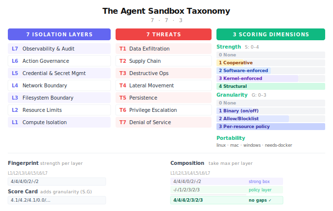

# The Agent Sandbox Taxonomy (AST)

*Version 1.0 — March 2026*

<p align="center">
  
</p>

---

## How to Use This

This document provides a shared language for discussing what agent sandboxes do, what they don't do, and which threats they address. Remember **7-7-3**: **7** isolation layers, **7** threat categories, **3** evaluation dimensions (strength, granularity, portability).

The document has two halves:

**The Taxonomy** (Parts 1–5) defines what sandboxes *are*. Seven isolation layers, seven threat categories, how they relate, how to score mechanisms, and how to fingerprint any product. Use it to describe, classify, and compare solutions on equal terms.

**The Framework** (Parts 6–8) defines what sandbox consumers should *do*. Composition patterns, anti-patterns, a decision checklist, and stacking rules. Use it to choose the right sandbox stack for your situation.

**The Appendix** contains product-specific data: score cards, fingerprint comparison tables, threat coverage matrices, and mechanism references. This is the only part that needs regular updating.

---

# THE TAXONOMY

*What sandboxes are, how to describe them, and how to compare them.*

---

## 1. The Problem

When someone says "we sandbox our agents," that could mean anything from a Docker container with no security hardening to a hardware-isolated microVM with default-deny egress and credential proxying.

AI coding agents must support full development workflows — package installation, compilation, test execution, database access, browser automation — while treating every generated command as potentially hostile. The agent might misbehave because of a hallucination, a prompt injection, a compromised dependency, or a misunderstanding of intent. The sandbox doesn't care *why*. It enforces boundaries regardless.

The Taxonomy decomposes sandboxing into **seven isolation layers** and maps them against **seven threat categories**, producing a precise vocabulary for what any sandbox does and doesn't do.

---

## 2. The Seven Isolation Layers

Every sandbox enforces some combination of seven layers. No sandbox covers all seven equally. Most cover two or three well and ignore the rest.

| Layer | Name | Key Question |
|---|---|---|
| **L7** | Observability & Audit | Can you see what the agent did? |
| **L6** | Action Governance | Can you control what operations it performs? |
| **L5** | Credential & Secret Management | How are secrets handled around the agent? |
| **L4** | Network Boundary | What can it communicate with? |
| **L3** | Filesystem Boundary | What can it read, write, and delete? |
| **L2** | Resource Limits | Is it constrained in CPU, memory, disk, time? |
| **L1** | Compute Isolation | What separates the agent from the host? |

Layers are numbered bottom-up because lower layers are foundational. Strong L1 makes L3 easier — a microVM gets a fresh filesystem by default. But **upper layers cannot be derived from lower ones**. A microVM with perfect L1 but no L4 still lets the agent exfiltrate secrets via a single outbound request. A system with impeccable L1–L5 but no L7 gives you no way to detect misuse or improve policies.

### L1 — Compute Isolation
*What separates the agent's execution from the host system?*

The foundational layer. No upper layer can be stronger than L1, because a process that escapes L1 bypasses everything above it. The key metric is the **size of the shared attack surface** between the sandboxed workload and the host — ranging from the full host kernel (containers), through a reduced syscall surface (user-space kernels), to a minimal VMM (microVMs), to a single-purpose kernel (unikernels), to hardware-encrypted memory (confidential computing). See **Appendix A** for the mechanism spectrum.

### L2 — Resource Limits
*Can the agent exhaust CPU, memory, disk, or time?*

A fork bomb or memory leak can denial-of-service the host even inside a perfect L1 boundary. Enforcement must happen **outside the sandbox** — cgroups on the host, or VM resource allocation by the hypervisor. An agent with root inside its sandbox can bypass in-sandbox resource controls but cannot escape hypervisor-level caps.

### L3 — Filesystem Boundary
*What can the agent read, write, and delete on disk?*

The boundary must be **selective**, not total — agents legitimately need to read/write project files. The critical question is whether sensitive paths (`~/.ssh`, `~/.aws`, `.env`) are accessible. Ranges from full access through path allowlists, sensitive-path blocklists, ephemeral roots, immutable roots with writable overlays, to fully independent filesystems.

### L4 — Network Boundary
*What external systems can the agent communicate with?*

The most underappreciated layer. An agent inside a perfect compute sandbox with unrestricted network access can still exfiltrate every secret via a single outbound request.

**How traffic is intercepted matters as much as whether it's intercepted.** A network boundary that relies on the sandboxed process honoring `HTTP_PROXY` env vars is fundamentally different from one that intercepts at the kernel level. The process can trivially bypass proxy env vars via raw sockets, `--noproxy` flags, or custom DNS. This is reflected in the strength score: cooperative enforcement (process must opt in) is strength 1, regardless of how sophisticated the proxy is. Only opaque enforcement (kernel/hypervisor interception the process cannot circumvent) or structural enforcement (no network device exists) earns strength 3–4.

### L5 — Credential & Secret Management
*Can the agent see, use, or exfiltrate credentials?*

Even with strong L1–L4, an agent with API keys can embed them in generated code or commit them to a repo. The ideal: credentials are **never present** in the agent's environment. Ranges from full credential access through file blocking, env-var filtering, placeholder substitution (secrets detected and swapped with tokens, restored at execution), credential proxying (external proxy authenticates on behalf), to ephemeral per-session tokens.

### L6 — Action Governance
*Can the agent perform destructive or unauthorized operations?*

L6 is different from L1–L5. Those layers restrict **access to resources**. L6 restricts **what the agent does with the access it has**. An agent with legitimate cloud access can still terminate instances. An agent with legitimate DB credentials can still drop tables.

L6 operates at a **semantic level** that cuts across lower layers. L3 says "you cannot write to this path." L4 says "you cannot connect to this destination." L6 says "you cannot delete production resources" — governing intent and effect regardless of which layer the action flows through. This lets L6 express policies no single lower layer can.

The tradeoff: L6 is generally software-enforced and bypassable in ways kernel/hardware enforcement is not. A command blocklist can be circumvented via shell redirection. L6 is defense-in-depth, most valuable on top of strong L1–L4.

### L7 — Observability & Audit
*Can you see what the agent did, when, and why?*

Without observability, you cannot detect misuse, investigate incidents, improve policies, or demonstrate compliance. L7 turns a sandbox from a static boundary into an **adaptive security system**. Ranges from no logging through session-level logs, command-level audit, full telemetry (network, syscalls, MCP tool calls, real-time UI), to cryptographic audit chains (tamper-evident logs with provenance tracking).

---

## 3. The Seven Threats

Agents can cause seven categories of harm. Sandboxes exist to contain them.

| ID | Threat | What Goes Wrong | Example |
|---|---|---|---|
| **T1** | **Data Exfiltration** | Agent reads sensitive data and transmits it externally | Reads SSH keys, sends via outbound request |
| **T2** | **Supply Chain Compromise** | Agent introduces malicious code — compromised dependencies, binary replacement, build artifact poisoning | Malicious install script exfiltrates env vars; package replaces trusted binary |
| **T3** | **Destructive Operations** | Agent destroys or misconfigures resources, **both local and remote** | Local: `rm -rf /`. Remote: cloud resource deletion via API, dropping DB tables, `kubectl delete namespace` |
| **T4** | **Lateral Movement** | Agent reaches systems beyond its intended scope | Scans local network, hits cloud metadata endpoint |
| **T5** | **Persistence** | Agent survives sandbox destruction | Writes cron job, modifies shell init files, installs git hooks |
| **T6** | **Privilege Escalation** | Agent escapes the sandbox entirely | Exploits kernel CVE, container escape |
| **T7** | **Denial of Service** | Agent consumes excessive resources, degrading host or other tenants | Fork bomb, memory bomb, disk filling |

### Prompt Injection Is a Vector, Not a Threat

Prompt injection is **not an eighth threat** — it is a **vector** that activates T1–T7. No sandbox technology can prevent prompt injection itself — that's an LLM-layer problem. Sandboxes limit the **blast radius** when injection succeeds.

```
  Prompt Injection ──┐
  Hallucination ─────┼──▶ Agent attempts harmful action ──▶ Sandbox boundary blocks it
  Malicious code ────┘
```

### How Layers Defend Against Threats

Threats don't respect layer boundaries. A single destructive operation might involve reading a credential (L3/L5), making a network request (L4), and executing a destructive API call (L6).

| Threat | Primary Defenses | Why Multiple Layers Are Needed |
|---|---|---|
| **T1 Exfiltration** | L3 + L4 + L5 | L3 blocks reading secrets, L4 blocks sending them out, L5 ensures they're not present. Any single layer alone leaks. |
| **T2 Supply Chain** | L3 + L4 + L7 | L4 controls download sources, L3 protects filesystem integrity (prevents binary replacement), L7 detects compromises after the fact. |
| **T3 Destructive Ops** | L3 + **L4** + L6 | L3 covers local destruction. **Remote destruction is a network operation** — needs L4 to block access or L6 to block the action semantically. L1 alone doesn't protect remote resources. |
| **T4 Lateral Movement** | L4 + L1 | L4 blocks outbound access. L1 provides network namespace isolation as secondary boundary. |
| **T5 Persistence** | L3 + L1 + L6 | Ephemeral sandboxes (L1 destroyed) inherently prevent persistence. Persistent sandboxes need L3 to block init file writes and L6 to block scheduled task creation. |
| **T6 Privilege Escalation** | L1 + L2 | L1 strength directly determines escape resistance. Hardware boundaries are fundamentally harder to escape than software boundaries. |
| **T7 Denial of Service** | L2 + L1 | L2 caps resources. Enforcement must be outside the sandbox (cgroups, hypervisor allocation). |

**Threats are not independent.** T2 is often a vector to T1/T3/T4. T5 extends the window for any other threat. T6 nullifies all other layers. T7 can be a direct goal or a side effect.

---

## 4. Scoring

Each layer is rated on two dimensions, plus a portability tag. Together these are the **three evaluation dimensions** in the 7-7-3 structure.

### Strength (S: 0–4)

Strength combines robustness of enforcement, reversibility, and enforcement transparency into a single score. A boundary that can be bypassed, reversed, or opted out of earns a lower score regardless of how sophisticated the mechanism is.

| Score | Level | What It Means |
|---|---|---|
| **0** | None | No enforcement at this layer |
| **1** | Cooperative | Enforcement that the sandboxed process can circumvent, opt out of, or that can be reversed via escape hatch. Includes: proxy env vars the process can ignore, advisory restrictions, configurations with known bypass mechanisms. If the process can open a raw socket and skip your filter, it's S:1. |
| **2** | Software-enforced | Enforced by a separate process or proxy that the sandboxed process cannot circumvent from inside, but that can be reconfigured from outside by the operator. Includes: container-level isolation, hot-reloadable policy engines, MITM proxies with iptables redirect |
| **3** | Kernel-enforced | Enforced by the OS kernel through mechanisms that cannot be weakened once applied, even by the operator during the session. Includes: Landlock, Seatbelt, seccomp-BPF, kernel-level network filtering. Irreversible. |
| **4** | Structural | Enforced by CPU virtualization, hardware encryption, or architectural absence — the protected resource or attack surface doesn't exist inside the sandbox. Includes: KVM-isolated microVMs, unikernels, network-disabled sandboxes (no network device), credential proxies (secrets never enter sandbox), confidential VMs (SEV-SNP/TDX). |

**Key principle:** Cooperative enforcement is always S:1, regardless of how sophisticated the proxy is. If the kernel denies the syscall, it's S:3. If there's no network device to use, it's S:4.

### Granularity (G: 0–3)

How fine-grained is the control at this layer?

| Score | Level | What It Means |
|---|---|---|
| **0** | None | No control |
| **1** | Binary | On/off (e.g., "network: enabled/disabled") |
| **2** | Allowlist/Blocklist | Lists of permitted or denied resources (e.g., "allow these domains", "block these paths") |
| **3** | Per-resource policy | Fine-grained rules per resource, action, and context (e.g., "allow GET but deny DELETE", Cedar/OPA policies per connection) |

### Portability

A flat tag answering: **what must already be in place to use this tool?**

| Tag | Meaning |
|---|---|
| **any-os** | Works on Linux, macOS, and Windows |
| **linux+mac** | Works on Linux and macOS (may use different mechanisms per OS) |
| **linux-only** | Requires Linux (often kernel ≥5.13 for Landlock) |
| **windows** | Supports Windows (may be in addition to other OSes) |
| **cloud-managed** | Runs in vendor's cloud; OS abstracted away |
| **needs-docker** | Requires Docker or compatible container runtime |
| **needs-kvm** | Requires `/dev/kvm` (bare metal or nested virtualization) |
| **needs-k8s** | Requires a Kubernetes cluster |
| **no-infra** | Runs directly on the OS; no Docker, no cloud, no cluster |

Products may have multiple tags (e.g., `linux+mac, no-infra`).

### The Fingerprint

Every product gets a **fingerprint** — a CVSS-inspired vector string showing its strength score at each layer. Each entry is `Layer:Score`, separated by `/`. A dash means the layer is not addressed.

**Full form** — self-describing, used in product score cards:
```
E2B      L1:4/L2:4/L3:4/L4:0/L5:2/L6:-/L7:2
```

**Compact form** — positional (L1 through L7, always in order), used in comparison tables and composition:
```
E2B      4/4/4/0/2/-/2
Leash    2/2/2/3/2/2/3
Warden   -/-/1/2/3/2/3
nono     3/-/3/3/3/2/2
```

The two forms are interchangeable. The compact form always includes all seven positions in L1→L7 order, so the layer labels can be read from the column header.

Score cards (see Appendix B) show each layer as `S.G` — strength and granularity separated by `.` (e.g., `4.1` = structural strength, binary granularity). The fingerprint uses strength only for the quick-compare view.

**Separator convention:** `:` binds a layer to its value (full form), `.` separates strength from granularity within a layer, `/` separates layers from each other.

See **Appendix B** for product score cards and **Appendix D** for the full fingerprint comparison table.

---

## 5. Glossary

| Term | Definition |
|---|---|
| **Blast radius** | Maximum damage when an agent is compromised or misbehaves |
| **Cooperative enforcement** | Enforcement relying on the sandboxed process respecting a convention (e.g., proxy env vars) — bypassable; always S:1 |
| **Defense-in-depth** | Layering multiple independent boundaries so failure of one doesn't compromise the system |
| **Escape hatch** | A mechanism allowing bypass of sandbox restrictions; its existence caps strength at S:1 |
| **Opaque enforcement** | Enforcement that works regardless of the sandboxed process's behavior — cannot be circumvented; S:2–3 |
| **Structural enforcement** | Enforcement where the protected resource doesn't exist inside the sandbox — nothing to bypass; S:4 |
| **Vector** | The method by which a threat is triggered (prompt injection, hallucination, malicious tool) — distinct from the threat itself |

---
---

# THE FRAMEWORK

*How to choose, compose, and stack sandbox solutions.*

---

## 6. Why Composition Is Necessary

No single product covers all seven layers well. This is by design — products that focus on L1–L3 (the isolation boundary) complement products that focus on L4–L7 (behavior governance, credentials, observability). Recognizing this is the most important insight from the Taxonomy.

The fingerprint makes this visible. Where one product shows `—` or `0`, another shows `3` or `4` — that's the complement. Stack them and the gaps disappear:

```
E2B       4/4/4/0/2/-/2  ← strong box, open network, no governance
Warden    -/-/1/2/3/2/3  ← no box, but governs behavior + secrets
────────────────────────
Composed  4/4/4/2/3/2/3  ← take the max at each layer
```

When composing, **take the maximum strength at each layer**. The composed stack is only as weak as its weakest uncovered layer.

---

## 7. Composition Patterns

### Platform + Policy Layer
*"Strong box, smart guardrails"*

A cloud sandbox platform provides L1–L3 (hardware-isolated compute, resource limits, ephemeral filesystem). A policy tool layers L4–L7 (network policies, credential management, action governance, observability). Full-stack coverage.

### OS-Level Wrapper + Policy Sidecar
*"Lightweight local protection"*

A kernel-level process wrapper provides L1/L3/L5 with irreversible enforcement. A policy sidecar adds L4/L6/L7. Full stack minus L2 (resource limits). Zero cost, no cloud dependency.

### Built-in Sandbox + Cloud Fallback
*"Local for speed, cloud for untrusted"*

The agent's built-in sandbox handles trusted interactive work (L1/L3/L4). Untrusted operations offload to a cloud platform with full L1–L3.

### K8s-Native Stack
*"Enterprise, self-hosted, policy-driven"*

A Kubernetes sandbox CRD (L1/L2/L3) + NetworkPolicy (L4) + policy engine (L6) + secrets manager (L5) + monitoring stack (L7). Full stack, self-hosted.

### Anti-Pattern: Platform Without Network Controls

A cloud platform provides excellent L1/L2/L3, but the user deploys with default (unrestricted) network access and passes cloud credentials as env vars. The agent runs in a perfect microVM but can still exfiltrate credentials, delete cloud resources, and reach internal services.

**This is the most common configuration in practice and a false sense of security.** Strong L1 is necessary but not sufficient. Look at the fingerprint — if L4 is `0`, you have a problem.

---

## 8. Decision Checklist

Work through these questions in order to determine what your sandbox stack needs.

**1. What is your trust level in the code?**
Untrusted code requires L1 S:4 (microVM/unikernel). Your own reviewed code can use S:2–3.

**2. Does the agent interact with remote resources (cloud, databases, APIs)?**
If yes with read-write access: L1 does **not** protect remote resources. You need L4 (block destructive endpoints), L6 (block destructive actions semantically), or L5 (scoped read-only credentials).

**3. Does the agent need network access?**
If no, disable it (L4 S:4). This eliminates T1 and T4 in one step. If yes, use allowlists (S:2–3) and invest in L5 and L7.

**4. Does the agent handle credentials?**
Ideally credentials are never present (L5 S:4 via proxy or ephemeral tokens). Never pass raw credentials if avoidable.

**5. Can you tolerate human-in-the-loop?**
If no (autonomous agents), you need L6 S:2+ (policy engine). This is where behavioral governance tools become essential.

**6. Do you need audit trails?**
For compliance or team use, L7 S:2+ with structured logs. Consider cryptographic audit chains for regulatory requirements.

**7. Ephemeral or persistent sandbox?**
Ephemeral inherently addresses T5. Persistent sandboxes must explicitly address T5 via immutable filesystems or monitored mutation.

**8. What are your portability constraints?**
No infrastructure → process wrappers (`no-infra`). Docker available → container wrappers, sidecars. Cloud/K8s → full platform range.

### After the Checklist

Map your answers to layer requirements, then scan the fingerprint comparison table (Appendix D) for products that cover those layers at the required strength. Where no single product covers your needs, compose two using the stacking rule (take the max at each layer). Verify the composed fingerprint has no zeros or dashes at layers you care about.

---
---

# APPENDIX A: Layer Mechanism Reference

Catalogs mechanisms at each layer with strength and granularity. Products listed as examples — not exhaustive.

*Last updated: March 2026*

## A.1 — L1 Compute Isolation

| Mechanism | S | G | How It Works |
|---|---|---|---|
| Bare process | 0 | 0 | No isolation; full user privileges |
| Linux namespaces + cgroups | 2 | 1 | PID/mount/net/user namespace separation; shared host kernel |
| Namespaces + seccomp/Landlock/Seatbelt | 3 | 1–2 | Kernel-enforced syscall filtering or LSM; irreversible |
| User-space kernel (gVisor) | 3 | 1 | Intercepts ~200 syscalls in userspace; ~60 host syscalls exposed |
| MicroVM — minimal VMM (Firecracker) | 4 | 1 | Dedicated kernel per workload via KVM; ~50K line Rust VMM |
| MicroVM — container-shaped (Kata) | 4 | 1 | Container-shaped VM; CRI compatible; needs KVM |
| Unikernel | 4 | 1 | Single-app custom kernel; ~1MB image; needs KVM |
| Library OS | 3–4 | 1 | Embedded minimal OS library; experimental |
| Confidential VM (SEV-SNP/TDX) | 4 | 1 | Hardware-encrypted memory; even hypervisor cannot read |

## A.2 — L2 Resource Limits

| Mechanism | S | G | How It Works |
|---|---|---|---|
| None | 0 | 0 | No limits |
| cgroups v2 | 3 | 2 | Kernel-enforced CPU/memory/I/O caps |
| VM resource allocation | 4 | 2 | Fixed vCPU/RAM/disk at VM creation |
| Platform quotas | 2 | 2 | Per-session or per-account limits |
| Time-bounded sessions | 2 | 1 | Auto-termination after time limit |

## A.3 — L3 Filesystem Boundary

| Mechanism | S | G | How It Works |
|---|---|---|---|
| No restriction | 0 | 0 | Full user filesystem |
| Working-dir-only mount | 3 | 2 | Only project dir visible; all else invisible |
| Sensitive-path blocklist | 3 | 2 | Most paths accessible; ~/.ssh, ~/.aws etc. blocked |
| Ephemeral root | 4 | 1 | Fresh OS per session; project mounted in |
| Immutable root + writable overlay | 4 | 2 | Read-only base; copy-on-write; rollback capable |
| Full independent filesystem | 4 | 1 | Separate disk; no host paths visible |

## A.4 — L4 Network Boundary

| Mechanism | S | G | How It Works |
|---|---|---|---|
| No restriction | 0 | 0 | Full network access |
| Proxy env vars | 1 | 2 | **Cooperative** — trivially bypassed via raw sockets |
| Transparent proxy (iptables redirect) | 2 | 3 | **Opaque** — all traffic redirected regardless of process |
| Kernel/hypervisor network filter | 3 | 2 | **Opaque** — iptables, eBPF, or Network Extension |
| MITM proxy (kernel-redirected) | 2–3 | 3 | **Opaque** — TLS-terminating; per-URL/method policies |
| Default-deny + exceptions | 3–4 | 2–3 | **Opaque/Structural** — all egress blocked; allowlist only |
| Network disabled | 4 | 1 | **Structural** — no network interface exists |

## A.5 — L5 Credentials

| Mechanism | S | G | How It Works |
|---|---|---|---|
| No restriction | 0 | 0 | Full credential set visible |
| Sensitive file blocking | 3 | 2 | Credential files blocked via L3; env vars still visible |
| Env-var filtering | 2 | 2 | Only approved variables forwarded |
| Placeholder substitution | 3 | 3 | Secrets swapped with tokens; restored at execution only |
| External credential proxy | 4 | 3 | Credentials never enter sandbox |
| Ephemeral per-session tokens | 4 | 3 | Time-bound, scoped credentials; auto-expire |

## A.6 — L6 Action Governance

| Mechanism | S | G | How It Works |
|---|---|---|---|
| No governance | 0 | 0 | Agent can do anything it has access to |
| Human-in-the-loop | 1 | 1 | Agent proposes; human approves |
| Command blocklist | 2 | 2 | Known-dangerous commands blocked |
| Policy engine (Cedar/OPA) | 2 | 3 | Fine-grained rules per action/resource/context |
| Declarative-only mode | 3 | 3 | Agent produces declarations only; cannot execute directly |

## A.7 — L7 Observability

| Mechanism | S | G | How It Works |
|---|---|---|---|
| No logging | 0 | 0 | No record of agent actions |
| Session-level logs | 1 | 1 | Start/stop, exit codes |
| Command-level audit | 2 | 2 | Every command, file op, tool call logged |
| Full telemetry | 3 | 3 | Network, syscalls, MCP calls, real-time UI |
| Cryptographic audit chain | 3 | 3 | Tamper-evident log with cryptographic commitments |

---

# APPENDIX B: Product Score Cards

Each card shows `S.G` (Strength.Granularity) per layer and a fingerprint (strength only, `Layer:Score` format). Dash (—) = layer not addressed.

*Last updated: March 2026*

### E2B
**Fingerprint: `L1:4/L2:4/L3:4/L4:0/L5:2/L6:-/L7:2`** · Portability: `cloud-managed`

| Layer | S.G | Notes |
|---|---|---|
| L1 Compute | 4.1 | Firecracker microVM; KVM isolation |
| L2 Resource | 4.2 | VM-allocated caps |
| L3 Filesystem | 4.1 | Ephemeral root |
| L4 Network | 0.0 | Not restricted by default; user-configurable |
| L5 Credentials | 2.2 | Env-var filtering |
| L6 Action | — | |
| L7 Observability | 2.2 | API-level logging |

Threats: T1● T2◐ T3◐(L●/R○) T4◐ T5● T6● T7● · Gaps: L4 not default; no L6 · Complements: Policy tools for L4–L7

### Daytona (Kata Containers mode)
**Fingerprint: `L1:4/L2:4/L3:4/L4:0/L5:2/L6:-/L7:1`** · Portability: `cloud-managed, needs-kvm`

| Layer | S.G | Notes |
|---|---|---|
| L1 Compute | 4.1 | Kata Containers; Cloud Hypervisor |
| L2 Resource | 4.2 | VM-allocated caps |
| L3 Filesystem | 4.1 | Ephemeral root |
| L4 Network | 0.0 | User-configurable |
| L5 Credentials | 2.2 | Env-var filtering |
| L6 Action | — | |
| L7 Observability | 1.1 | Basic logs |

Threats: T1● T2◐ T3◐(L●/R○) T4◐ T5● T6● T7● · BYOC available

### Modal
**Fingerprint: `L1:3/L2:3/L3:3/L4:0/L5:2/L6:-/L7:2`** · Portability: `cloud-managed`

| Layer | S.G | Notes |
|---|---|---|
| L1 Compute | 3.1 | gVisor user-space kernel |
| L2 Resource | 3.2 | Container-level limits |
| L3 Filesystem | 3.1 | Ephemeral |
| L4 Network | 0.0 | No default restriction |
| L5 Credentials | 2.2 | Env-var filtering |
| L6 Action | — | |
| L7 Observability | 2.2 | Platform logs |

Threats: T1● T2◐ T3◐(L●/R○) T4◐ T5● T6◐ T7● · GPU support (T4→H100)

### Fly.io Sprites
**Fingerprint: `L1:4/L2:4/L3:4/L4:0/L5:2/L6:-/L7:1`** · Portability: `cloud-managed`

| Layer | S.G | Notes |
|---|---|---|
| L1 Compute | 4.1 | Firecracker microVM |
| L2 Resource | 4.2 | VM-allocated caps |
| L3 Filesystem | 4.1 | Full independent; 100GB NVMe |
| L4 Network | 0.0 | No default restriction |
| L5 Credentials | 2.2 | Env injection |
| L6 Action | — | |
| L7 Observability | 1.1 | Basic logs |

Threats: T1● T2◐ T3◐(L●/R○) T4◐ T5◐(persistent) T6● T7● · Persistent VMs; zero idle charges

### Blaxel
**Fingerprint: `L1:4/L2:4/L3:4/L4:0/L5:2/L6:-/L7:2`** · Portability: `cloud-managed`

| Layer | S.G | Notes |
|---|---|---|
| L1 Compute | 4.1 | Firecracker-forked microVM |
| L2 Resource | 4.2 | VM-allocated caps |
| L3 Filesystem | 4.2 | Immutable root + overlay; snapshot/rollback |
| L4 Network | 0.0 | User-configurable; egress IP control |
| L5 Credentials | 2.2 | Env-var filtering |
| L6 Action | — | |
| L7 Observability | 2.2 | Observability suite |

Threats: T1● T2◐ T3◐(L●/R○) T4◐ T5●(rollback) T6● T7● · 25ms resume; SOC2/HIPAA

### Unikraft Cloud
**Fingerprint: `L1:4/L2:3/L3:4/L4:0/L5:2/L6:-/L7:2`** · Portability: `cloud-managed, needs-kvm`

| Layer | S.G | Notes |
|---|---|---|
| L1 Compute | 4.1 | Unikernel VM; minimal single-app kernel |
| L2 Resource | 3.2 | VM-allocated |
| L3 Filesystem | 4.1 | Full independent |
| L4 Network | 0.1 | Platform-configurable |
| L5 Credentials | 2.1 | Env injection |
| L6 Action | — | |
| L7 Observability | 2.2 | Prometheus/Grafana |

Threats: T1● T2◐ T3◐(L●/R○) T4◐ T5● T6● T7● · 10-50ms cold start; 100K+ VMs/server

### StrongDM Leash
**Fingerprint: `L1:2/L2:2/L3:2/L4:3/L5:2/L6:2/L7:3`** · Portability: `linux+mac, needs-docker (Linux) or Leash.app (macOS)`

| Layer | S.G | Notes |
|---|---|---|
| L1 Compute | 2.1 | Docker container |
| L2 Resource | 2.2 | Container limits |
| L3 Filesystem | 2.1 | Container mount |
| L4 Network | 3.3 | Linux: iptables→MITM; macOS: Network Extension (kernel) |
| L5 Credentials | 2.2 | Env-var forwarding |
| L6 Action | 2.3 | Cedar policies; governs network + filesystem + MCP |
| L7 Observability | 3.3 | Real-time web UI; MCP observer; full telemetry |

Threats: T1◐ T2◐ T3●(L+R Cedar) T4● T5◐ T6○ T7◐ · Complements: MicroVM platforms for L1

### Stakpak Warden
**Fingerprint: `L1:-/L2:-/L3:1/L4:2/L5:3/L6:2/L7:3`** · Portability: `linux+mac, no-infra`

| Layer | S.G | Notes |
|---|---|---|
| L1 Compute | — | Not a compute sandbox |
| L2 Resource | — | |
| L3 Filesystem | 1.1 | Backup before edit |
| L4 Network | 2.3 | Transparent proxy; iptables redirect; Cedar per-request |
| L5 Credentials | 3.3 | 210+ secret types; placeholder substitution |
| L6 Action | 2.3 | Cedar; blocks destructive cloud/infra operations |
| L7 Observability | 3.3 | Full session trace; mTLS |

Threats: T1●(secrets) T2○ T3●(R via Cedar) T4● T5○ T6○ T7○ · Complements: Any L1 solution · Rust; Apache-2.0

### nono
**Fingerprint: `L1:3/L2:-/L3:3/L4:3/L5:3/L6:2/L7:2`** · Portability: `linux+mac, no-infra`

| Layer | S.G | Notes |
|---|---|---|
| L1 Compute | 3.1 | Landlock (Linux) / Seatbelt (macOS); irreversible |
| L2 Resource | — | |
| L3 Filesystem | 3.2 | Per-path read/write/deny; irreversible |
| L4 Network | 3.1 | `--net-block`; kernel-enforced; binary only |
| L5 Credentials | 3.2 | Sensitive paths auto-blocked; irreversible |
| L6 Action | 2.2 | Command blocklist |
| L7 Observability | 2.2 | Structured JSON audit; crypto snapshots |

Threats: T1● T2○ T3◐(L●/R○) T4◐ T5● T6◐ T7○ · ALL restrictions IRREVERSIBLE · Rust; Apache-2.0

### Claude Code (local sandbox)
**Fingerprint: `L1:3/L2:-/L3:3/L4:0/L5:3/L6:1/L7:1`** · Portability: `linux+mac, no-infra`

| Layer | S.G | Notes |
|---|---|---|
| L1 Compute | 3.1 | bubblewrap (Linux) / Seatbelt (macOS) |
| L2 Resource | — | |
| L3 Filesystem | 3.2 | Sensitive path blocking |
| L4 Network | 0.0 | No default restriction |
| L5 Credentials | 3.2 | Sensitive file paths blocked |
| L6 Action | 1.1 | Human-in-the-loop |
| L7 Observability | 1.1 | Basic session logs |

Threats: T1◐ T2○ T3◐(L◐/R○) T4○ T5◐ T6◐ T7○ · Complements: nono (L4), Leash (L4+L6+L7), cloud (L2) · MIT

### Claude Code (web sandbox)
**Fingerprint: `L1:4/L2:3/L3:4/L4:4/L5:4/L6:1/L7:2`** · Portability: `cloud-managed`

| Layer | S.G | Notes |
|---|---|---|
| L1 Compute | 4.1 | Managed VM; hardware isolation |
| L2 Resource | 3.2 | VM-allocated |
| L3 Filesystem | 4.1 | Ephemeral; repo only |
| L4 Network | 4.2 | Default-deny egress; structural |
| L5 Credentials | 4.3 | External git proxy; credentials never enter sandbox |
| L6 Action | 1.1 | Human-in-the-loop |
| L7 Observability | 2.2 | Session logs |

Threats: T1● T2◐ T3●(L+R) T4● T5● T6● T7● · Credentials never enter sandbox

### OpenAI Codex (agent phase)
**Fingerprint: `L1:3/L2:3/L3:4/L4:4/L5:4/L6:1/L7:2`** · Portability: `cloud-managed`

| Layer | S.G | Notes |
|---|---|---|
| L1 Compute | 3.1 | OS-enforced sandbox |
| L2 Resource | 3.2 | Platform-managed |
| L3 Filesystem | 4.1 | Ephemeral workspace |
| L4 Network | 4.1 | Network disabled; structural |
| L5 Credentials | 4.3 | Secrets stripped before agent phase |
| L6 Action | 1.1 | Human-in-the-loop |
| L7 Observability | 2.2 | Task-level audit |

Threats: T1● T2◐(setup phase) T3●(L+R no-net) T4● T5● T6◐ T7● · Two-phase model

### Cursor (sandboxed mode)
**Fingerprint: `L1:3/L2:-/L3:2/L4:3/L5:2/L6:1/L7:1`** · Portability: `linux+mac, no-infra`

| Layer | S.G | Notes |
|---|---|---|
| L1 Compute | 3.1 | Landlock (Linux) / Seatbelt (macOS) |
| L2 Resource | — | |
| L3 Filesystem | 2.2 | Path blocking; workspace + /tmp |
| L4 Network | 3.1 | Network disabled; kernel-enforced |
| L5 Credentials | 2.2 | Path blocking |
| L6 Action | 1.1 | Human-in-the-loop |
| L7 Observability | 1.1 | Basic logs |

Threats: T1◐ T2○ T3◐(L◐/R●no-net) T4●(no-net) T5◐ T6◐ T7○

### Docker Sandbox
**Fingerprint: `L1:4/L2:3/L3:3/L4:0/L5:2/L6:-/L7:1`** · Portability: `any-os, windows, needs-docker`

| Layer | S.G | Notes |
|---|---|---|
| L1 Compute | 4.1 | MicroVM inside Docker Desktop |
| L2 Resource | 3.2 | VM-allocated |
| L3 Filesystem | 3.1 | Workspace bind-mount; private Docker daemon |
| L4 Network | 0.0 | No default restriction |
| L5 Credentials | 2.2 | Env-var filtering |
| L6 Action | — | |
| L7 Observability | 1.1 | Basic logs |

Threats: T1● T2◐ T3◐(L●/R○) T4◐ T5● T6● T7● · Native Claude/Copilot/Gemini support

### Google Agent Sandbox (K8s CRD)
**Fingerprint: `L1:3/L2:3/L3:3/L4:0/L5:2/L6:-/L7:1`** · Portability: `linux-only, needs-k8s`

| Layer | S.G | Notes |
|---|---|---|
| L1 Compute | 3–4.1 | gVisor (default) or Kata (opt-in) |
| L2 Resource | 3.2 | K8s resource quotas |
| L3 Filesystem | 3.1 | Ephemeral; PVC optional |
| L4 Network | 0.0 | Via K8s NetworkPolicy (user-configured) |
| L5 Credentials | 2.2 | K8s Secrets |
| L6 Action | — | |
| L7 Observability | 1.1 | K8s audit log |

SIG Apps project; warm pools; hibernation; SandboxClaim API

---

# APPENDIX C: Threat Coverage Matrix

**●** Primary defense, **◐** Partial, **○** Not addressed. T3: `L●/R○` = local mitigated/remote not; `L+R` = both.

*Last updated: March 2026*

| Product | T1 | T2 | T3 | T4 | T5 | T6 | T7 |
|---|---|---|---|---|---|---|---|
| E2B | ● | ◐ | ◐ L●/R○ | ◐ | ● | ● | ● |
| Daytona (Kata) | ● | ◐ | ◐ L●/R○ | ◐ | ● | ● | ● |
| Modal | ● | ◐ | ◐ L●/R○ | ◐ | ● | ◐ | ● |
| Fly.io Sprites | ● | ◐ | ◐ L●/R○ | ◐ | ◐ | ● | ● |
| Blaxel | ● | ◐ | ◐ L●/R○ | ◐ | ● | ● | ● |
| Unikraft | ● | ◐ | ◐ L●/R○ | ◐ | ● | ● | ● |
| Docker Sandbox | ● | ◐ | ◐ L●/R○ | ◐ | ● | ● | ● |
| Leash | ◐ | ◐ | ● L+R | ● | ◐ | ○ | ◐ |
| Stakpak Warden | ● | ○ | ● L◐/R● | ● | ○ | ○ | ○ |
| nono | ● | ○ | ◐ L●/R○ | ◐ | ● | ◐ | ○ |
| Claude Code (local) | ◐ | ○ | ◐ L◐/R○ | ○ | ◐ | ◐ | ○ |
| Claude Code (web) | ● | ◐ | ● L+R | ● | ● | ● | ● |
| Codex (agent) | ● | ◐ | ● L+R | ● | ● | ◐ | ● |
| Cursor (sandboxed) | ◐ | ○ | ◐ L◐/R● | ● | ◐ | ◐ | ○ |
| Copilot agent | ◐ | ◐ | ◐ | ◐ | ● | ◐ | ◐ |

**Patterns**: Cloud platforms cluster at T3 ◐ (L●/R○) — strong box, open window for remote destruction. Policy tools score T3 ● and T4 ● but T6 ○. Local OS tools score T7 ○ universally. T2 is universally ◐ or ○.

---

# APPENDIX D: Fingerprint Comparison Table

All products side by side, using the compact fingerprint form. Read vertically to compare at a layer. Read horizontally for a product's profile. Stack vertically (take max per column) to see composed coverage.

*Last updated: March 2026*

```
                         L1/L2/L3/L4/L5/L6/L7   Portability
                         ─────────────────────   ───────────
CLOUD PLATFORMS
  E2B                     4/ 4/ 4/ 0/ 2/ -/ 2   cloud-managed
  Daytona (Kata)          4/ 4/ 4/ 0/ 2/ -/ 1   cloud-managed
  Modal                   3/ 3/ 3/ 0/ 2/ -/ 2   cloud-managed
  Fly.io Sprites          4/ 4/ 4/ 0/ 2/ -/ 1   cloud-managed
  Blaxel                  4/ 4/ 4/ 0/ 2/ -/ 2   cloud-managed
  Unikraft Cloud          4/ 3/ 4/ 0/ 2/ -/ 2   cloud-managed
  Docker Sandbox          4/ 3/ 3/ 0/ 2/ -/ 1   any-os, windows, needs-docker
  Google Agent Sandbox    3/ 3/ 3/ 0/ 2/ -/ 1   linux-only, needs-k8s

POLICY & CREDENTIAL TOOLS
  StrongDM Leash          2/ 2/ 2/ 3/ 2/ 2/ 3   linux+mac, needs-docker
  Stakpak Warden          -/ -/ 1/ 2/ 3/ 2/ 3   linux+mac, no-infra

OS-LEVEL WRAPPERS
  nono                    3/ -/ 3/ 3/ 3/ 2/ 2   linux+mac, no-infra
  packnplay               2/ 2/ 2/ 0/ 2/ -/ 1   linux+mac, needs-docker

BUILT-IN AGENT SANDBOXES
  Claude Code (local)     3/ -/ 3/ 0/ 3/ 1/ 1   linux+mac, no-infra
  Claude Code (web)       4/ 3/ 4/ 4/ 4/ 1/ 2   cloud-managed
  Codex (agent phase)     3/ 3/ 4/ 4/ 4/ 1/ 2   cloud-managed
  Cursor (sandboxed)      3/ -/ 2/ 3/ 2/ 1/ 1   linux+mac, no-infra
  Copilot agent           2/ 2/ 2/ 2/ 2/ 1/ 1   cloud-managed
  Devin                   4/ 3/ 3/ 2/ 2/ 1/ 2   cloud-managed
```

### Composition Examples

```
                         L1/L2/L3/L4/L5/L6/L7
  E2B                     4/ 4/ 4/ 0/ 2/ -/ 2
+ Stakpak Warden          -/ -/ 1/ 2/ 3/ 2/ 3
──────────────────────────────────────────────────
= Composed (max)          4/ 4/ 4/ 2/ 3/ 2/ 3   ← gaps filled
```

```
                         L1/L2/L3/L4/L5/L6/L7
  Claude Code (local)     3/ -/ 3/ 0/ 3/ 1/ 1
+ nono                    3/ -/ 3/ 3/ 3/ 2/ 2
+ Leash                   2/ 2/ 2/ 3/ 2/ 2/ 3
──────────────────────────────────────────────────
= Composed (max)          3/ 2/ 3/ 3/ 3/ 2/ 3   ← only L1 not at 4
```

---

*The Taxonomy (Parts 1–5) and Framework (Parts 6–8) should remain stable. Appendices (A–D) updated as products change. Feedback welcome.*
